# CTF Pilot's Error Fallback

**Error fallback webserver**

This repository contains a webserver, which is used as the fallback webserver for errors.  
It allows for custom error pages to be shown when errors occur in the CTF Pilot ecosystem.

## How to run

For Kubernetes environments, deploy the deployment file provided in `k8s`.  
This can be done with `kubectl`:

```sh
kubectl apply -f k8s/k8s.yml
```

The service can also be run locally, using the provided Docker compose file:

```sh
docker compose up -d
```

A [Docker image](https://github.com/ctfpilot/error-fallback/pkgs/container/error-fallback) is automatically built and published to GitHub Container Registry for each release.  
You can pull the latest image with:

```sh
docker pull ghcr.io/ctfpilot/error-fallback:latest
```

*For the versions available, please see the [releases page](https://github.com/ctfpilot/error-fallback/releases).*

## Pages

Each page is generated from a file in [`src/content`](./src/content) (see [Development](#development) below) and is served as static HTML behind a reverse proxy. Which page is shown is determined by whichever HTTP status code the proxy maps to this service. Every page automatically polls the original request's host and reloads once it starts responding normally again, so the page updates on its own once the underlying issue is resolved.

| Page        | Title                  | Intended use                                                                       |
| ----------- | ----------------------- | ------------------------------------------------------------------------------------- |
| `index.html` | Error                   | Generic fallback page for errors that don't have a more specific page.               |
| `401.html`   | Unauthorized            | Authentication is required to access this resource.                                  |
| `403.html`   | Forbidden               | The request is authenticated but the caller doesn't have permission.                 |
| `404.html`   | Not found               | The requested page could not be found.                                               |
| `405.html`   | Method Not Allowed      | The HTTP method used is not supported for the requested resource.                    |
| `500.html`   | Error                   | Same generic message as `index.html`, with an added link back to the home page.      |
| `502.html`   | Bad gateway             | The service did not respond correctly.                                               |
| `503.html`   | No service available    | The service is temporarily unavailable, e.g. while restarting or under maintenance.  |
| `504.html`   | Gateway timeout         | The service did not respond in time, e.g. while restarting or under maintenance.     |

<details>
<summary>Preview of each page</summary>

| Page | Light mode | Dark mode |
| --- | --- | --- |
| **Index** | 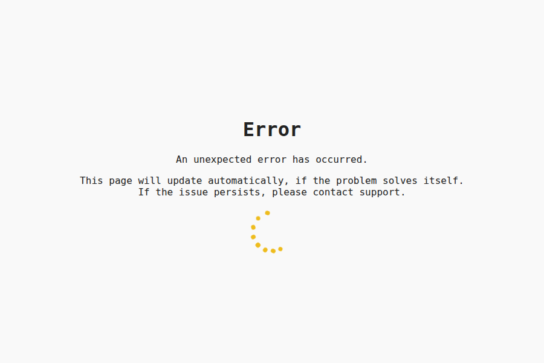 | 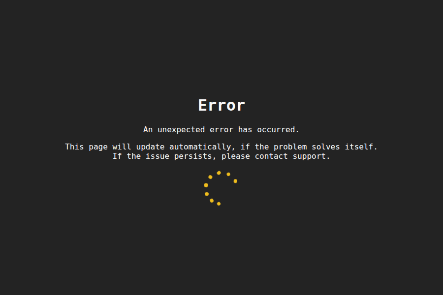 |
| **401 Unauthorized** | 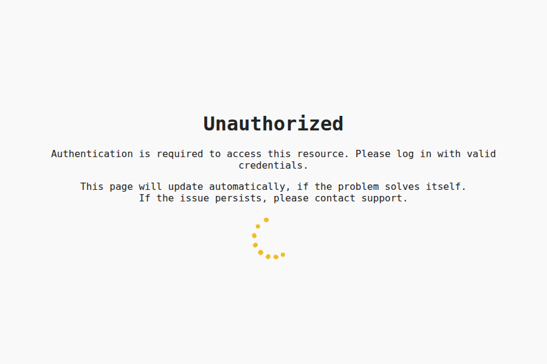 | 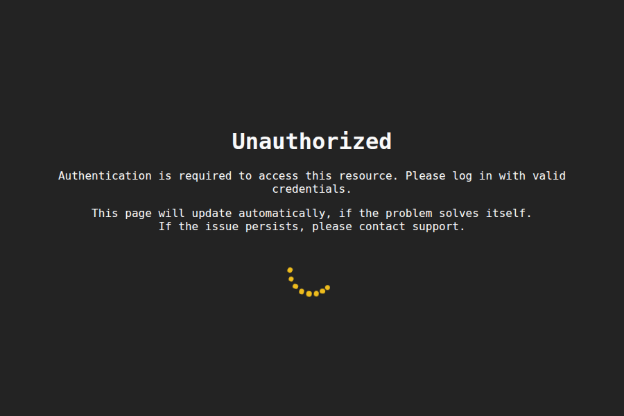 |
| **403 Forbidden** | 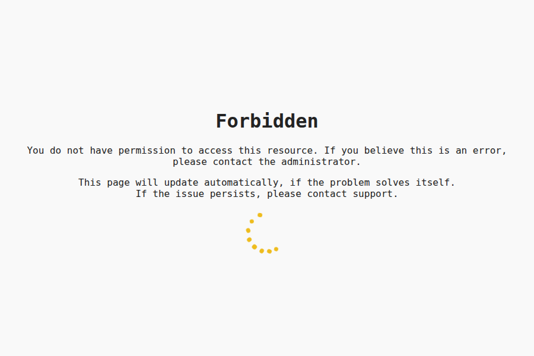 | 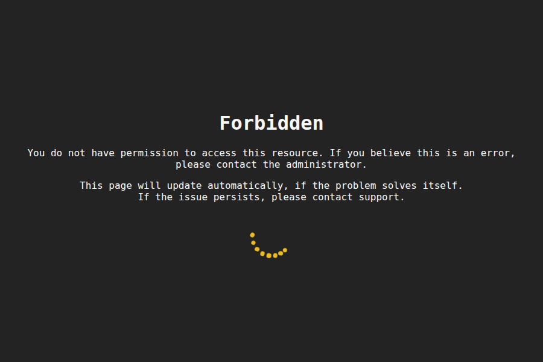 |
| **404 Not found** | 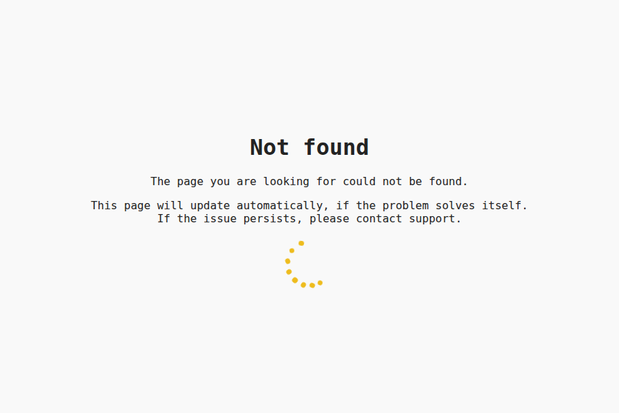 | 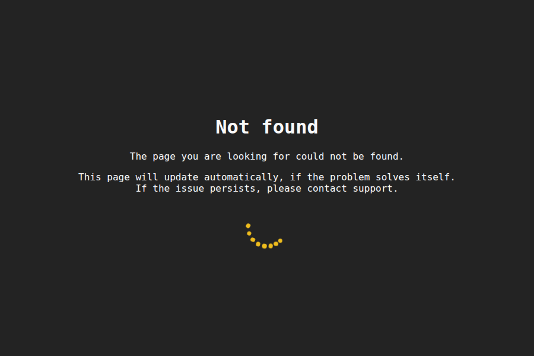 |
| **405 Method Not Allowed** | 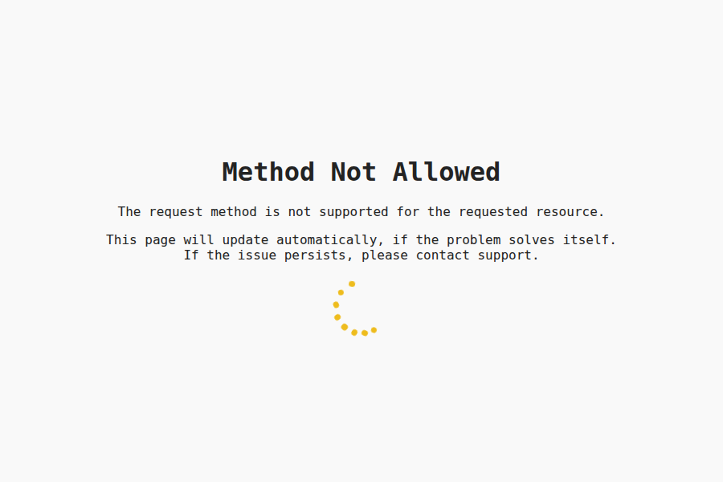 | 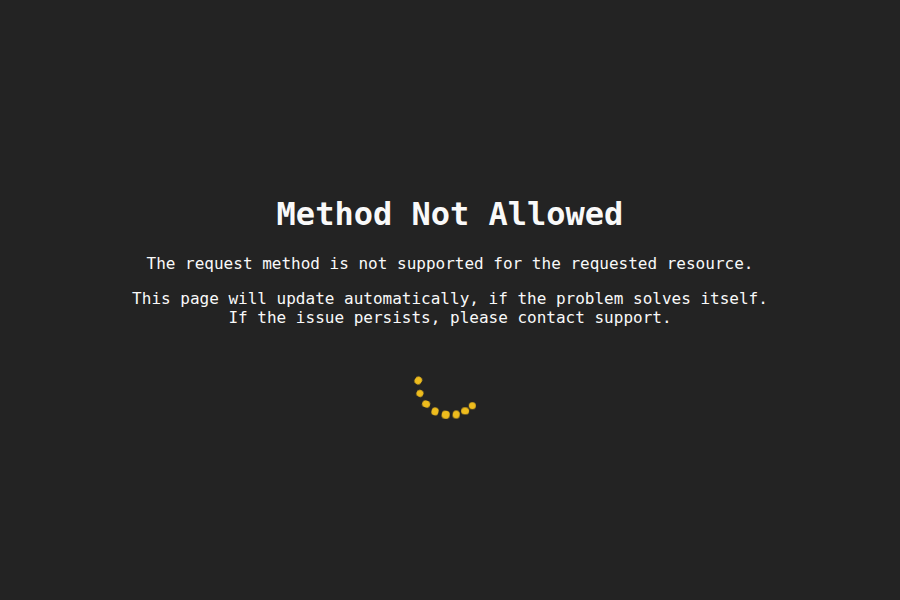 |
| **500 Error** | 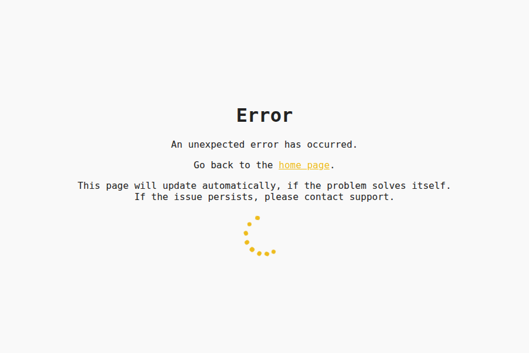 | 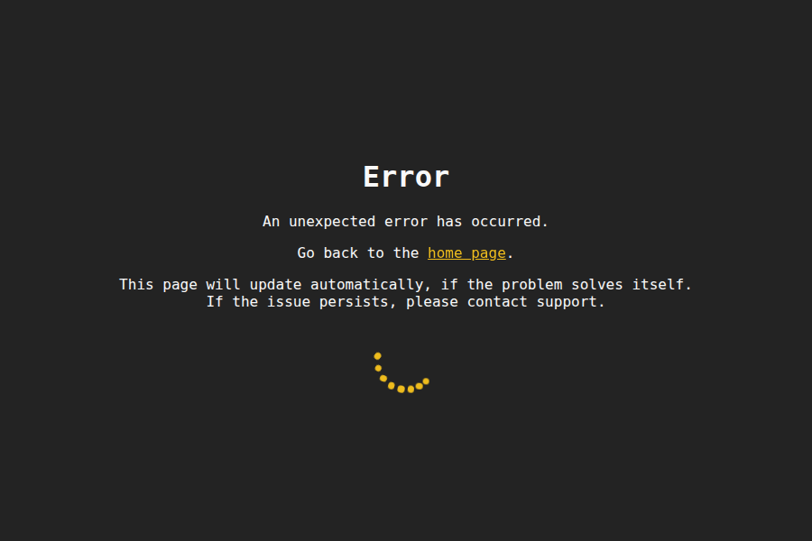 |
| **502 Bad gateway** | 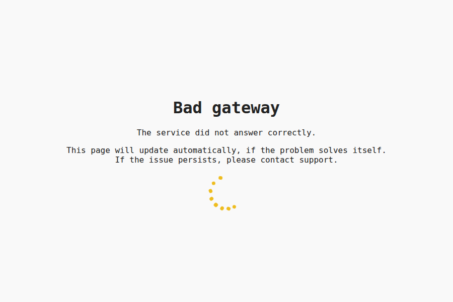 | 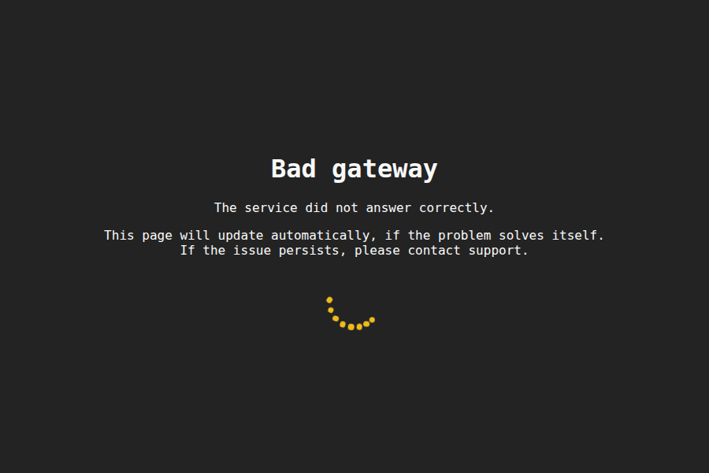 |
| **503 No service available** | 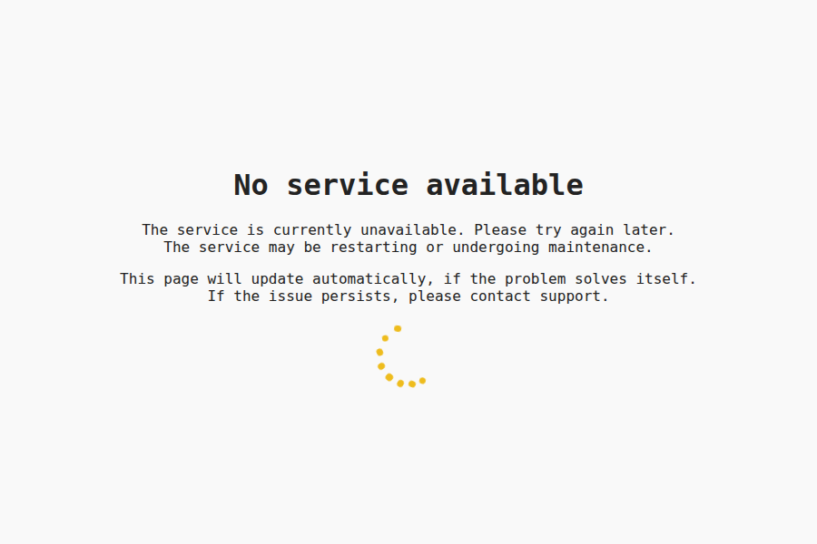 | 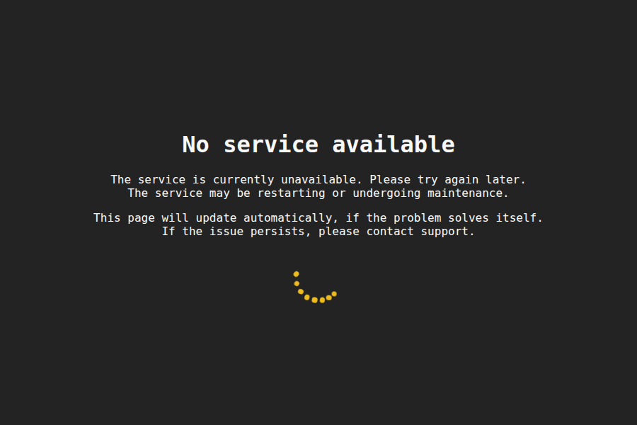 |
| **504 Gateway timeout** | 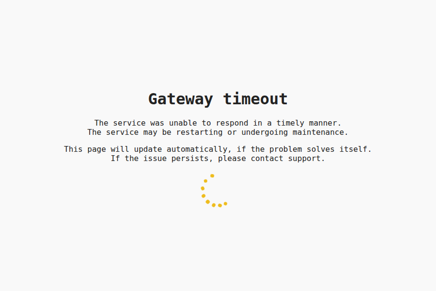 | 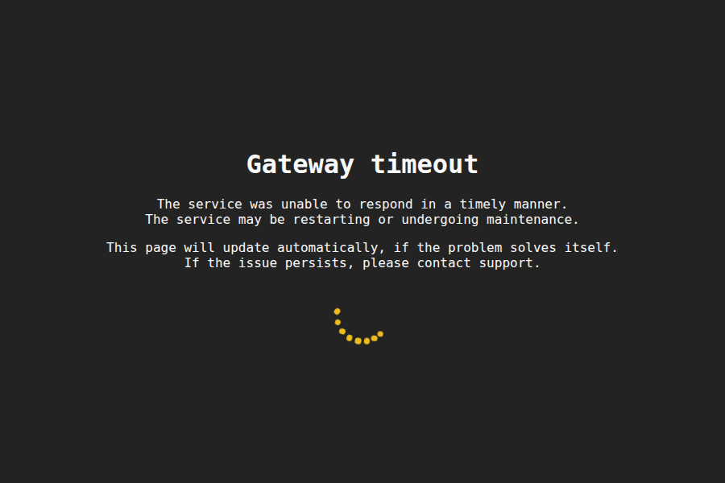 |

</details>

### Development

In order to generate the pages, run the [`generator.py`](./src/generator.py) script in `src`:

```sh
python3 src/generator.py
```

*This is done automatically in the Docker container build process.*

To update the Kubernetes deployment file, update the deployment template in `template/k8s.yml`.  
An updated `k8s/k8s.yml` will then be automatically generated on the next release.

## Contributing

We welcome contributions of all kinds, from **code** and **documentation** to **bug reports** and **feedback**!

Please check the [Contribution Guidelines (`CONTRIBUTING.md`)](/CONTRIBUTING.md) for detailed guidelines on how to contribute.

To maintain the ability to distribute contributions across all our licensing models, **all code contributions require signing a Contributor License Agreement (CLA)**.
You can review **[the CLA here](https://github.com/ctfpilot/cla)**. CLA signing happens automatically when you create your first pull request.  
To administrate the CLA signing process, we are using **[CLA assistant lite](https://github.com/marketplace/actions/cla-assistant-lite)**.

*A copy of the CLA document is also included in this repository as [`CLA.md`](CLA.md).*  
*Signatures are stored in the [`cla` repository](https://github.com/ctfpilot/cla).*

## License

This component and repository is licensed under the **EUPL-1.2 License**.  
You can find the full license in the **[LICENSE](LICENSE)** file.

We encourage all modifications and contributions to be shared back with the community, for example through pull requests to this repository.  
We also encourage all derivative works to be publicly available under the **EUPL-1.2 License**.  
At all times must the license terms be followed.

For information regarding how to contribute, see the [contributing](#contributing) section above.

CTF Pilot is owned and maintained by **[The0Mikkel](https://github.com/The0mikkel)**.  
Required Notice: Copyright Mikkel Albrechtsen (<https://themikkel.dk>)

## Code of Conduct

We expect all contributors to adhere to our [Code of Conduct](/CODE_OF_CONDUCT.md) to ensure a welcoming and inclusive environment for all.
